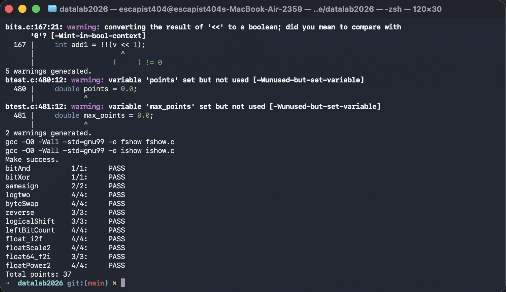

# datalab 报告

* 姓名：熊洋铭
* 学号：2025201731

| 总分 | bitAnd | bitXor | samesign | logtwo | byteSwap | reverse | logicalShift | leftBitCount | float_i2f | floatScale2 | float64_f2i | floatPower2 |
| ---- | ------ | ------ | -------- | ------- | -------- | ------- | ------------ | ------------- | ---------- | ------------ | ------------ | ------------ |
| 37 | 1 | 1 | 2 | 4 | 4 | 3 | 3 | 4 | 4 | 4 | 3 | 4 |


test 截图：



## 解题报告

### 亮点

<!-- 告诉助教哪些函数是你实现得最优秀的，比如你可以排序。不需要展开，展开请放到后文中。 -->

1. samesign
2. byteSwap
3. float64_f2i

#### samesign

```c
int samesign(int x, int y) {
    return !((x ^ y) >> 31) && !(!x ^ !y);
}
```

当 `x ^ y` 的符号位为 `1` 时，`!((x ^ y) >> 31)` 为 `0`，这说明 `x` 和 `y` 异号；当 `x` 和 `y` 恰有一个为 `0` 时，`!(!x ^ !y)` 为 `0`，这说明 `x` 和 `y` 异号。

仅当 `x ^ y` 的符号位为 `0` 且 `x` 和 `y` 要么同时为 `0` 要么同时不为 `0` 时，返回值为 `1`，这说明 `x` 和 `y` 同号。

#### byteSwap

```c
int byteSwap(int x, int n, int m) {
    int ns = n << 3;
    int ms = m << 3;
    int a = (x >> ns) & 0xFF;
    int b = (x >> ms) & 0xFF;
    int d = a ^ b;
    return x ^ (d << ns) ^ (d << ms);
}
```

用 `a` 和 `b` 分别表示第 `n` 个字节和第 `m` 个字节，`d` 表示这两个字节的异或值。利用 `a := a ^ d` 和 `b := b ^ d`，可以将 `x` 中的第 `n` 个字节和第 `m` 个字节交换。

#### float64_f2i

```c
int float64_f2i(unsigned uf1, unsigned uf2) {
    unsigned s = uf2 >> 31;
    unsigned e = (uf2 & 0x7FF00000) >> 20;

    if (e < 1023) {
        return 0;
    }

    if (e >= 1054) {
        return 0x80000000;
    }

    unsigned intv = 0x80000000 | ((uf2 & 0xFFFFF) << 11) | (uf1 >> 21);
    intv = intv >> (1054 - e);

    int ret = intv;
    if (s) {
        ret = -ret;
    }

    return ret;
}
```

回忆 IEEE 754 双精度浮点数的表示方法，符号位占 1 位，指数位占 11 位，尾数占 52 位；`int` 类型的范围是 `-2^31` 到 `2^31 - 1`。首先提取符号位 `s` 和指数位 `e`，并注意到向零取整可以直接看作舍弃尾数末位。

当 `e < 1023` 时，说明浮点数的绝对值小于 `1`，向零取整后为 `0`；当 `e >= 1054` 时，说明浮点数的绝对值大于等于 `2^31`，原数向零取整后为溢出或者恰为 `INT_MIN`，返回 `0x80000000`。

其他情况，提取尾数的高 31 位（`uf1` 的低 20 位和 `uf2` 的高 11 位），与 `0x80000000` 做或运算得到整数部分的二进制表示。然后根据指数位 `e` 的大小右移相应的位数，最后根据符号位 `s` 返回正负整数。

## 反馈/收获/感悟/总结

我觉得这个 lab 很有挑战性，尤其是在处理浮点数和位运算的部分，需要仔细理解 IEEE 754 标准和位操作的细节。通过完成这个 lab，我对计算机底层的数据表示和运算有了更深的理解。

## 参考的重要资料

- [IEEE 754 标准](https://en.wikipedia.org/wiki/IEEE_754)
- [位运算指南](https://en.wikipedia.org/wiki/Bitwise_operation)
